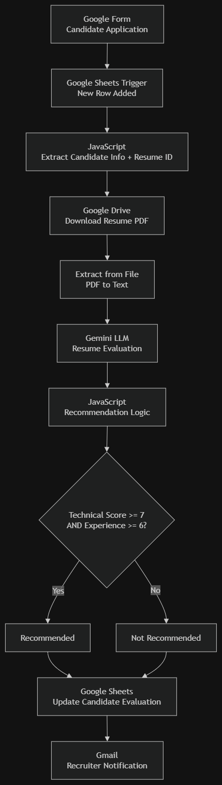

# Automated Resume Screening System

An AI-powered automated resume screening workflow built using **n8n**, **Google APIs**, and **Gemini LLM**. The system automatically evaluates resumes submitted through a Google Form and sends recruiter recommendations without manual intervention.

## Tech Stack

- n8n
- Google Forms
- Google Sheets 
- Google Drive 
- Gmail 
- Google Gemini (LLM)

---

## Workflow Architecture



---

## How It Works

1. Candidate submits application through **Google Form**.
2. A new row in **Google Sheets** triggers the n8n workflow.
3. JavaScript extracts candidate details and Resume ID.
4. Resume PDF is downloaded from **Google Drive**.
5. PDF text is extracted automatically.
6. **Gemini LLM** evaluates the resume against weighted hiring criteria.
7. JavaScript applies recommendation logic.
8. Candidate is marked as **Recommended** or **Not Recommended**.
9. Google Sheets is updated with scores and decision.
10. Recruiter receives an automated email summary through Gmail.

---

## Features

- Event-driven workflow using n8n.
- Automated PDF resume extraction.
- AI-based resume evaluation with Gemini.
- Weighted candidate scoring.
- Rule-based hiring recommendation.
- Automatic Google Sheets updates.
- Automated recruiter email notifications.

---

## Repository Structure

```text
workflow/
    resume-screening-workflow.json

screenshots/
    workflow-architecture.png
```

## Import Workflow

Import `workflow/resume-screening-workflow.json` into n8n to run the workflow.
